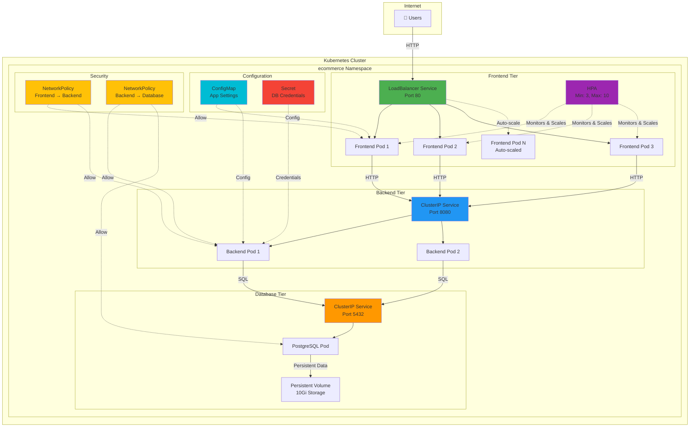

# E-Commerce Application Architecture

## System Overview

This document describes the architecture of the multi-tier e-commerce Kubernetes application.

## Component Diagram



## Network Flow

### Request Path (User → Frontend → Backend → Database)

```
1. User Request
   └─→ LoadBalancer (Internet-facing)
       └─→ Frontend Pod (3-10 replicas)
           └─→ Backend Service (ClusterIP)
               └─→ Backend Pod (2 replicas)
                   └─→ PostgreSQL Service (ClusterIP)
                       └─→ PostgreSQL Pod (StatefulSet)
                           └─→ Persistent Volume
```

### Response Path (Database → Backend → Frontend → User)

```
1. Database Query Result
   └─→ Backend Pod
       └─→ Frontend Pod
           └─→ LoadBalancer
               └─→ User's Browser
```

## Deployment Specifications

### Frontend Deployment

| Property | Value |
|----------|-------|
| **Type** | Deployment |
| **Replicas** | 3 (min) - 10 (max) |
| **Container Port** | 8080 |
| **Service Type** | LoadBalancer |
| **Service Port** | 80 → 8080 |
| **CPU Request** | 200m |
| **Memory Request** | 256Mi |
| **Auto-scaling** | Yes (HPA) |
| **Trigger** | CPU > 70% |
| **Image** | `ecommerce/frontend:latest` |

### Backend Deployment

| Property | Value |
|----------|-------|
| **Type** | Deployment |
| **Replicas** | 2 (fixed) |
| **Container Port** | 8080 |
| **Service Type** | ClusterIP |
| **Service Port** | 8080 |
| **CPU Request** | 300m |
| **Memory Request** | 512Mi |
| **Auto-scaling** | No |
| **Image** | `ecommerce/backend:latest` |

### Database StatefulSet

| Property | Value |
|----------|-------|
| **Type** | StatefulSet |
| **Replicas** | 1 (fixed) |
| **Container Port** | 5432 |
| **Service Type** | ClusterIP (Headless) |
| **Service Port** | 5432 |
| **CPU Request** | 500m |
| **Memory Request** | 1Gi |
| **Storage** | 10Gi PVC |
| **Image** | `postgres:15-alpine` |

## Service Communication

### Service Discovery

All services use Kubernetes DNS:

```
Frontend → Backend
  http://backend-service:8080

Backend → Database
  postgresql://postgres-service:5432/ecommerce_db
```

### Port Mapping

```
Frontend Service:
  External: 80 (LoadBalancer IP)
  Internal: 8080 (Container Port)

Backend Service:
  Internal: 8080 (Service Port)
  Container: 8080 (Container Port)

Database Service:
  Internal: 5432 (Service Port)
  Container: 5432 (Container Port)
```

## Configuration Management

### ConfigMap (Non-Sensitive)

Stores environment-specific configuration:

```yaml
DATABASE_HOST: postgres-service
DATABASE_PORT: 5432
BACKEND_URL: http://backend-service:8080
```

### Secret (Sensitive)

Stores encrypted credentials:

```yaml
POSTGRES_USER: ecommerce_user
POSTGRES_PASSWORD: changeme123  # ⚠️ CHANGE IN PRODUCTION
POSTGRES_DB: ecommerce_db
```

## Security Architecture

### Network Policies

#### 1. Frontend → Backend Policy
- **Purpose**: Allow frontend to communicate with backend
- **Rule**: Pods with label `tier=frontend` can access pods with label `tier=backend` on port 8080
- **Effect**: Blocks all other ingress to backend

#### 2. Backend → Database Policy
- **Purpose**: Allow backend to communicate with database
- **Rule**: Pods with label `tier=backend` can access pods with label `tier=database` on port 5432
- **Effect**: Blocks all other ingress to database

### Isolation Layers

```
Layer 1: Namespace Isolation
  └─ All resources in 'ecommerce' namespace

Layer 2: Service Type Isolation
  └─ LoadBalancer: Frontend (public)
  └─ ClusterIP: Backend, Database (private)

Layer 3: Network Policy Isolation
  └─ Frontend can only talk to Backend
  └─ Backend can only talk to Database
  └─ Database has no direct external access

Layer 4: Secret Management
  └─ Credentials stored in Kubernetes Secrets
  └─ Mounted as environment variables (not in code)
```

## Auto-Scaling Behavior

### Horizontal Pod Autoscaler (HPA)

The frontend automatically scales based on CPU usage:

```
Scenario 1: Low Traffic (< 70% CPU)
  └─ Maintains minimum 3 replicas

Scenario 2: High Traffic (> 70% CPU)
  └─ Scales up to 10 replicas
  └─ Adds 1 pod at a time
  └─ Waits 3 minutes before scaling up again

Scenario 3: Traffic Drops (< 70% CPU)
  └─ Scales down to minimum 3 replicas
  └─ Removes 1 pod at a time
  └─ Waits 5 minutes before scaling down again
```

## Data Persistence

### StatefulSet vs Deployment

| Aspect | StatefulSet (Database) | Deployment (Frontend/Backend) |
|--------|------------------------|-------------------------------|
| **Identity** | Stable (postgres-0) | Random (backend-7d8f9-x2k1m) |
| **Storage** | Persistent (survives restarts) | Ephemeral (lost on restart) |
| **Scaling** | Ordered (0, 1, 2...) | Random |
| **Use Case** | Databases, stateful apps | Stateless apps, APIs |

### Volume Claim Template

The database uses a PersistentVolumeClaim (PVC):

```yaml
Name: postgres-storage
Size: 10Gi
AccessMode: ReadWriteOnce
MountPath: /var/lib/postgresql/data
```

This ensures database data survives pod restarts and rescheduling.

## Resource Allocation

### Total Cluster Requirements

| Resource | Minimum | With Max Scaling |
|----------|---------|------------------|
| **CPU** | 1.6 cores | 3.6 cores |
| **Memory** | 3.3 GiB | 5.1 GiB |
| **Storage** | 10 GiB | 10 GiB |

### Per-Component Breakdown

```
Frontend:
  Min: 3 pods × 200m CPU = 600m CPU
  Max: 10 pods × 200m CPU = 2000m CPU
  Memory: 256Mi per pod

Backend:
  Fixed: 2 pods × 300m CPU = 600m CPU
  Memory: 512Mi per pod (1Gi total)

Database:
  Fixed: 1 pod × 500m CPU = 500m CPU
  Memory: 1Gi
  Storage: 10Gi persistent
```

## High Availability Considerations

### Current Setup

✓ **Frontend**: 3+ replicas (high availability)
✓ **Backend**: 2 replicas (basic redundancy)
⚠️ **Database**: 1 replica (single point of failure)

### Production Recommendations

1. **Database HA**: Use a managed database service (Cloud SQL, RDS) or PostgreSQL replication
2. **Multi-Zone**: Spread pods across availability zones
3. **Pod Disruption Budgets**: Ensure minimum pods during updates
4. **Health Checks**: Add liveness and readiness probes
5. **Resource Limits**: Set CPU/memory limits (not just requests)

## Monitoring Points

### Key Metrics to Track

```
Frontend:
  ├─ Request rate (req/sec)
  ├─ Response time (ms)
  ├─ Error rate (%)
  └─ CPU usage (for auto-scaling)

Backend:
  ├─ API endpoint latency
  ├─ Request rate per endpoint
  ├─ Database connection pool usage
  └─ Error rate by endpoint

Database:
  ├─ Query execution time
  ├─ Connection count
  ├─ Disk I/O
  └─ Storage usage (PVC size)

Infrastructure:
  ├─ Pod restarts
  ├─ Node resource usage
  ├─ Network policy violations
  └─ PVC usage
```

## Upgrade Strategy

### Rolling Update (Default)

```
Frontend & Backend:
  Strategy: RollingUpdate
  MaxUnavailable: 25%
  MaxSurge: 25%

  Process:
  1. Create new pod with new image
  2. Wait for pod to be Ready
  3. Terminate old pod
  4. Repeat for next pod
```

### Database Updates

```
StatefulSet:
  Strategy: RollingUpdate (but risky for databases)

  Recommended:
  1. Backup database first
  2. Test in staging environment
  3. Schedule maintenance window
  4. Consider blue-green deployment
```

## Disaster Recovery

### Backup Strategy

```yaml
Database:
  Frequency: Daily (minimum)
  Retention: 30 days
  Method: pg_dump or volume snapshots
  Test Restores: Monthly

Configuration:
  Frequency: On every change
  Method: Git repository
  Location: Version control

Secrets:
  Frequency: On creation/change
  Method: Secure vault (HashiCorp Vault, AWS Secrets Manager)
  Location: Encrypted storage
```

## Cost Optimization

### Resource Efficiency

```
Current Setup:
  Frontend: Scales with demand (cost-efficient)
  Backend: Fixed 2 replicas (could add HPA)
  Database: Fixed 1 replica (appropriate for single DB)

Optimization Options:
  1. Add HPA to backend if usage varies
  2. Use node auto-scaling for cluster
  3. Use spot instances for non-critical workloads
  4. Right-size resource requests based on actual usage
```

## Related Documentation

- [README.md](README.md) - Full setup guide
- [QUICKSTART.md](QUICKSTART.md) - 5-minute deployment guide
- [ecommerce.go](ecommerce.go) - Source code for all resources
